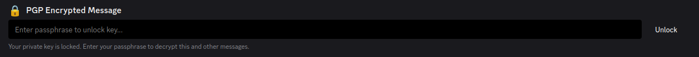
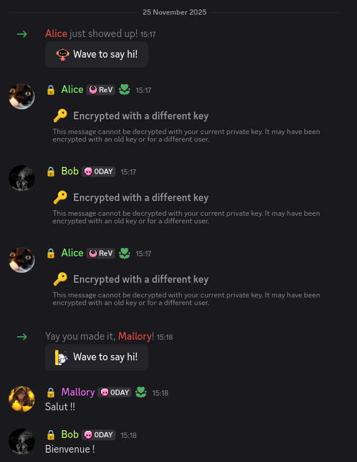
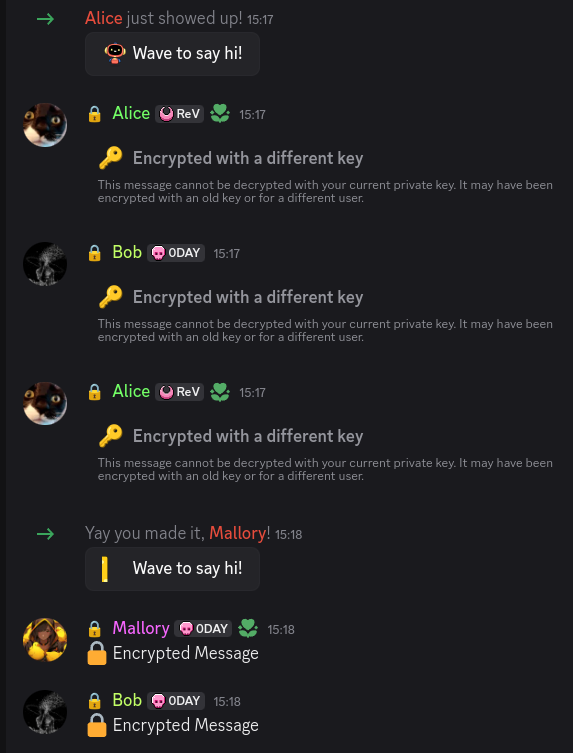

# 🔒 PGPCord


> **You can talk with anybody that has pgpcord installed!**

PGPCord brings true End-to-End Encryption (E2EE) to Discord using the OpenPGP standard. Your messages are encrypted on your device and can only be decrypted by the intended recipients. Not even Discord can read them.

---

## ✨ Features

- [x] **Encrypt Private Chat**: Secure 1-on-1 conversations with full PGP encryption.
- [x] **Encrypt Multi-Recipient**: Works seamlessly in Group DMs and Server Channels.
- [x] **Automated Key Discovery**: Automatically finds public keys based on Discord IDs using our keyserver.
- [x] **Ping Working**: Mentions and notifications work as expected.
- [x] **Fully Functional Chat**: Code blocks, markdown, and standard Discord formatting are preserved inside encrypted messages.
- [ ] **Image/File Upload**: *Coming Soon!* (Currently placeholder)

---

## 🛠️ Requirements

- **Shelter**: Included with [Legcord](https://legcord.app/) or injectable into most Discord clients (Vencord, etc.).

## 📦 Installation

### Option 1: Shelter Plugin Browser
1.  Open **User Settings** -> **Shelter** -> **Plugins**.
2.  Search for `PGPCord` (if available in the official list).
3.  Click **Install**.

### Option 2: Manual Install
1.  Open **User Settings** -> **Shelter** -> **Plugins**.
2.  Click **Add Plugin** (or "Add by URL").
3.  Paste the following URL:
    ```
    https://zerostats.github.io/pgpcord/pgpcord/
    ```
4.  Click **Add Plugin**.

---

## 🚀 Usage

### 1. Setup Your Keys
Go to **Settings > PGPCord**.
Generate a new key pair with a **strong passphrase**.
*Your private key is encrypted with this passphrase. If you lose it, your messages are lost forever.*


### 2. Publish Your Identity
Click the **Publish** button in settings.
You will be asked to link your current Discord account to verify your identity. This allows others to find your public key automatically.

### 3. Start Chatting!

Enable disable encryption per chat by pressing the **Lock Icon** in the chat bar.


When the lock is green, everything you type is encrypted.

When reloading the app you will need to reenter your passphrase.



#### 4. Group Chat


#### 5. Plain Chat



---

## 💻 Development

### Prerequisites
-   **Git**
-   **Node.js**
-   **Lune**: `npm install -g @uwu/lune`

### Setup
```bash
git clone https://github.com/Zerostats/pgpcord.git
cd pgpcord
npm install
```

### Building
```bash
npx lune build pgpcord
```

---

### Known Issues

- Dom is not reloaded without scrolling when prompt or miss keyz
- Shelter injector in chrome is not working due to data persistence

---

## 📄 License

This project is licensed under the MIT License.
